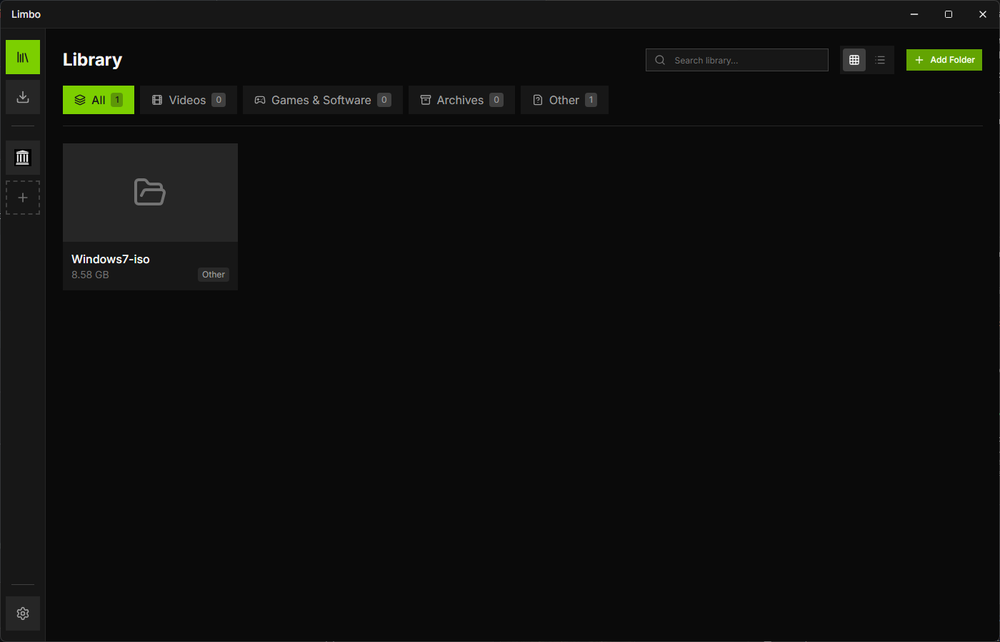

# Limbo

Limbo is a desktop software manager with an integrated browser, download manager, torrent client, Debrid integration, and library view. The UI is React + TypeScript. The desktop host is **Sabine** (Rust).



## What It Does

- Direct HTTP/HTTPS downloads with queue management
- Torrent downloads from magnet links and `.torrent` files
- Real-Debrid, AllDebrid, Premiumize, and TorBox support for supported flows
- Embedded browser with bookmarks, popup blocking, and short-lived session memory
- Local library for downloaded software, media, archives, and other files
- Magnet and `.torrent` file association support in packaged builds

## Tech Stack

- [Sabine](https://github.com/Lantharos/Sabine) with a shared Chromium runtime
- librqbit for torrents
- Vite + React 19 + TypeScript
- Tailwind CSS
- Base UI / shadcn-style components

## Legal Notice

Limbo is a general-purpose download and organization tool. It supports direct downloads, BitTorrent, Debrid services, and local file management.

Users are solely responsible for ensuring they have the legal right to access, download, and possess any content used with this application. Limbo does not host or provide infringing content.

## Download

Download the latest Limbo release from [GitHub Releases](https://github.com/kaleidal/limbo/releases/latest). Packages are available for Windows, Intel and Apple Silicon Macs, and x86-64 Linux.

The public website is [limbo.kaleid.al](https://limbo.kaleid.al).

These initial packages are not yet signed with Apple or Microsoft developer certificates. Windows may show a SmartScreen warning. On macOS, allow Limbo from **System Settings → Privacy & Security** after the first launch attempt. Linux packages do not require an application-signing certificate.

Limbo installs and maintains its shared Sabine Chromium runtime on first launch, so the initial startup requires an internet connection.

## Development

### Prerequisites

- [Bun](https://bun.sh)
- Rust (stable, 1.89+)
- Sabine CLI

Install the matching Sabine tools:

```bash
cargo install --git https://github.com/Lantharos/Sabine --tag v0.1.12 sabine-cli
```

### Install

```bash
bun install
```

### Run

```bash
bun run dev:desktop
```

This lets Sabine own the Vite process on port 5177, prepares the shared Chromium runtime when needed, and runs the Rust host from `desktop/`.

To run only the Vite UI in a browser:

```bash
bun run dev
```

## Build

### Build Renderer

```bash
bun run build
```

### Build Desktop Host

```bash
bun run build:desktop
```

### Bundle Desktop App

```bash
bun run bundle:desktop
```

Pass `--target portable`, `--target deb`, `--target msi`, or `--target dmg` directly to `sabine bundle` when you need a specific package format.

## Companion API

Limbo exposes an authenticated localhost HTTP API so companion apps can manage torrents without embedding a torrent client.

The v2 API accepts cross-origin requests from any companion app. Health is public; torrent and event endpoints require the bearer token from Limbo's local discovery file. New torrent requests show an approval prompt by default, with an option to trust the verified executable.

- Health: `GET http://127.0.0.1:17890/v1/health`
- List torrents: `GET /v1/torrents` with `Authorization: Bearer <token>`
- Add torrent: `POST /v1/torrents` with `{ "magnet": "...", "fileIndex": 0, "sequential": true, "clientId": "my-app", "clientName": "My App" }` and `Authorization: Bearer <token>`
- Torrent status: `GET /v1/torrents/:id` with `Authorization: Bearer <token>`
- Stream: `GET /v1/torrents/:id/stream/:fileIndex?token=<token>` with byte-range support
- Remove torrent: `DELETE /v1/torrents/:id?deleteFiles=false` with `Authorization: Bearer <token>`
- Progress events: `GET /v1/events` with `Authorization: Bearer <token>`
- Discovery file under Limbo’s app data directory contains `{ port, token, baseUrl }`

Toggle the API, configure approval prompts, revoke trusted apps, or rotate the access token under Settings → Torrent Settings → Companion API.

## Associations

Packaged builds register support for:

- `magnet:` links
- `.torrent` files

## License

This project is licensed under the MIT License. See [LICENSE](./LICENSE).
